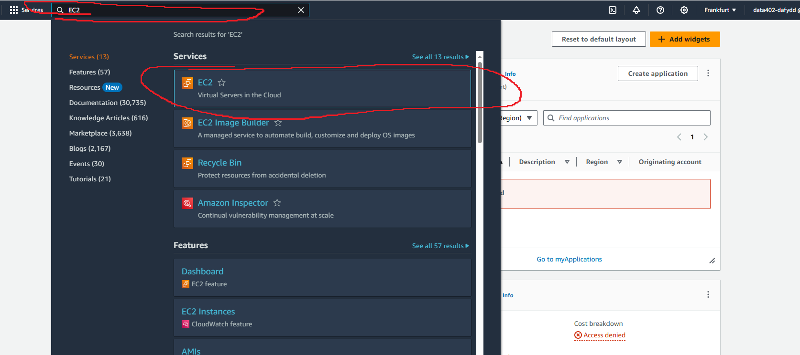

# Setting up an AWS instance

## Login to AWS
Go to this url: https://sparta-devops.signin.aws.amazon.com/console

Enter account ID sparta-devops

Enter your username

Enter your password

## Create instance
### Set server
Click on the location at the top right

Then select frankfurt

### Find EC2

Use the search bar at the top to search for EC2

### Create an instance

Click launch instance

### Settings
#### Name and tags

Give your instance a name

#### Application and OS images
Select Ubuntu and set the version to 22.04 LTS from the dropdown

Keep 64-bit (x86) architecture

#### Instance type

Select the instance type t2.micro

#### Key pair (login)

From the dropdown, select DataStudents
#### Network Settings

Click on the edit button

Leave VPC, Subnet and Auto-assign public IP at default

Create a new security group

Give it a name

Give it a description

**Give it rules**
We are going to give three rules

Add a rule that accepts ssh from anywhere (not the best practice, but fine for training).

Add a rule that accepts http from anywhere.

Add a rule that is Custom TCP that accepts data from anywhere on the port 27017.

#### Storage

The default storage configuration will do.
#### Finalise
Click launch instance in the summary tab on the right

Success, click the instance link to view the instance

## Connect ssh
Download the DataStudents.rem file and put it on your ~/.ssh folder

Open gitbash, and execute `cd ~/.ssh`

Execute the command `chmod 400 "DataStudents.pem"`

In AWS, click on the instacne id on the instances page

Click connect:

Select SSH client:

Copy the example ssh command

and paste it into git bash

Et voila:

