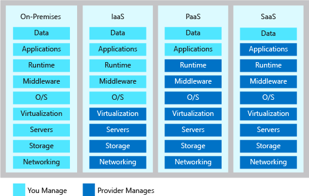
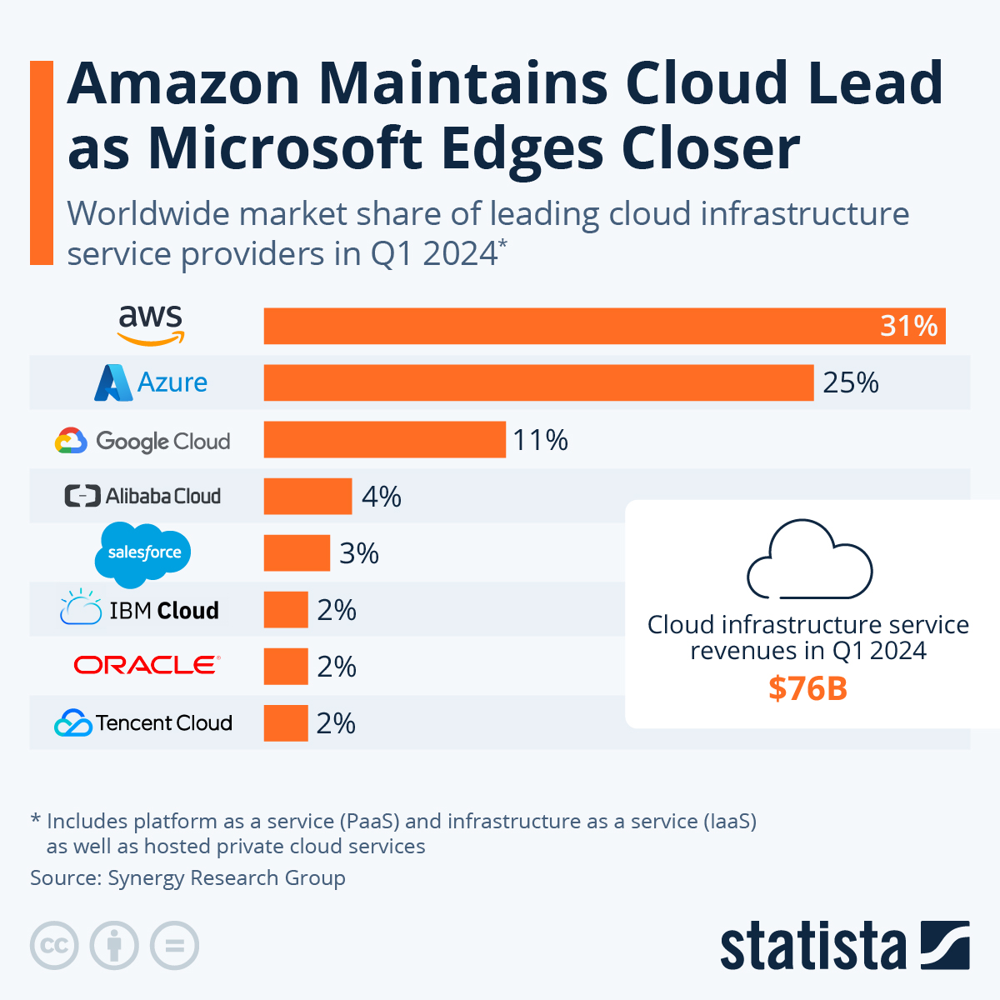

# Cloud

## What is Cloud Computing?
Cloud computing is the delivery of various services through the internet, including storage, processing power, and software applications. 
Instead of maintaining physical servers or personal devices for these functions, users can access and manage these resources online.
## How de we know if something is in the cloud?
There are five ways to know if something is in the cloud:
1. We access the service via the internet.
2. Subscription based model – Cloud services are often offered as a subscription.
3. Scalability – Cloud services can scale resources up or down based on demand.
4. Remote accessibility - Cloud service can often be accessed from multiple devices and locations.
5. Lack of Local Installation - If you don't need to install software on your local machine to use the service, then it is likely in the cloud.
## Differences between on-prem and cloud?

On-prem describes using machines that are build on location, whereas cloud is for using cloud based services for deployment.
Here are the main differences:

|                         | On-Prem                                                                         | Cloud                                                                              |
|-------------------------------|---------------------------------------------------------------------------------|------------------------------------------------------------------------------------|
| Infrastructure and Deployment | Hardware and software are owned, managed, and located on-site.                  | Resources are hosted off-site by a cloud provider and accessed via the internet.   |
| Cost                          | High upfront costs for hardware and ongoing maintenance expenses.               | Minimal initial costs with a pay-as-you-go model.                                  |
| Scalability                   | Limited by physical capacity; scaling up is slow and expensive.                 | Highly scalable with near-instantaneous adjustments based on demand.               |
| Maintenance and Management    | Organization is responsible for all maintenance and updates.                    | Cloud provider handles maintenance and updates.                                    |
| Security and Compliance       | Direct control over security and easier to meet specific compliance needs.      | Robust security from providers; compliance varies but often meets many standards.  |
| Flexibility and Innovation    | Less flexible and slower to adopt new technologies.                             | High flexibility and access to advanced tools and services for innovation.         |
| Performance and Reliability   | High performance locally, but dependent on in-house management for reliability. | High performance with global distribution and built-in redundancy for reliability. |
| Disaster Recovery and Backup  | Requires additional investment and complex planning.                            | Integrated disaster recovery and backup solutions.                                 |

## The 4 deployment models of cloud
### Private
A private cloud is dedicated to a single organization. 
It can be hosted on-premises or by a third-party provider but remains exclusively accessible by that organization.
Benefits:
- **Control:** Greater control over hardware, software, and data security.
- **Customisation:** Can be tailored to the specific needs of the organisation.
- **Security:** Enhanced security and privacy, ideal for sensitive data and compliance requirements.

Use Cases:
- Large enterprises with strict regulatory or security requirements
- Financial institutions
- Healthcare organisations
### Public
A public cloud is a cloud infrastructure provided by third-party service providers over the internet, available to the general public.
Benefits:
- **Cost-Effective**: Pay-as-you-go pricing, reducing capital expenditures.
- **Scalability**: Virtually unlimited scalability with resources available on demand.
- **Maintenance**: The provider handles all infrastructure maintenance and management.

Use cases:
- Startups
- Small to medium sized businesses
- Applications with variable workloads
### Hybrid
A hybrid cloud combines private and public clouds, allowing data and applications to be shared between them.
Benefits:
 - **Flexibility**: Can run sensitive workloads in the private cloud and less critical workloads in the public cloud. 
 - **Cost Efficiency**: Optimize costs by balancing between private and public clouds. 
 - **Scalability**: Allows scalability by offloading excess demand to the public cloud.

Use Cases:
- Businesses needing a mix of both private and public cloud benefits
- Businesses with fluctuating workloads
- Businesses requiring disaster recovery solutions
### Multi-Cloud
A multi-cloud strategy uses multiple public cloud services from different providers, avoiding dependency on a single provider.
Benefits:
- **Redundancy**: Increased reliability and redundancy by distributing workloads across multiple cloud environments.
- **Flexibility**: Choose the best services from each provider to meet specific business or technical needs.
- **Avoid Vendor Lock-In**: Reduces dependency on a single cloud provider.

Use Cases:
- Enterprises seeking to optimize performance, cost, and reliability
- Those wanting to mitigate risks associated with a single provider

## Types of cloud service
### IaaS
Infrastructure as a Service (IaaS) provides virtualized computing resources over the internet. Users can rent virtual machines, storage, and networks.

Examples: Amazon Web Services (AWS). Microsoft Azure, Google Cloud Platform (GCP)

### PaaS
Platform as a Service offers hardware and software tools over the internet. 
It is used for application development without worrying about the underlying infrastructure.

Examples: Heroku, Google App Engine, Microsoft Azure App Services

### SaaS
Software as a Service delivers software applications over the internet on a subscription basis. 
Users can access these applications via web browsers without installation.

Examples: Office 365, Google Workspace, Salesforce, Adobe

## Advantages and Disadvantages of cloud
### Advantages
- **Cost Efficiency** - reduces capital expenditure by eliminating need for physical hardware
- **Scalability** - scale resources up and down easily
- **Accessibility** - access from anywhere with internet
- **Maintenance** - handled by provider
- **Disaster Recovery**
- **Performance**
- **Innovation** - access advanced tools and services
- **Flexibility** - quickly experiment and adopt new technologies
- **Collaboration** - Allow multiple users to work on the same documents and applications simultaneously
- **Security** - major cloud services offer robust security

### Disadvantages
- **Security and Privacy** - Potential security risks associated with data being stored off-site and accessed over the internet.
- **Downtime** - Dependence on internet connectivity can lead to downtime if the connection is lost or if the provider experiences outages.
- **Limited Control** - Reduced control over the physical infrastructure and reliance on the provider for maintenance and management.
- **Cost Management** - Potential for unexpected costs due to pay-as-you-go pricing models if not carefully monitored.
- **Compliance** - Ensuring compliance with industry regulations can be challenging when data is stored in the cloud.
- **Vendor Lock-In** - Dependence on a single provider can make it difficult to switch providers or migrate services.
- **Performance Variability** - Performance can be affected by network latency and other factors beyond the organization’s control.
- **Complexity** - Managing and integrating multiple cloud services can add complexity to IT operations.
- **Data Transfer Costs** - Transferring large volumes of data to and from the cloud can incur significant costs.
- **Limited Customization** - Less ability to customize infrastructure compared to on-premises solutions.
## OpEx and CapEx
Capital Expenditure (CapEx) refers to the funds used by an organization to acquire, upgrade, and maintain physical assets such as property, buildings, or equipment. 
These expenses are typically one-time, significant investments.

Operational Expenditure (OpEx) refers to the ongoing expenses required for the day-to-day running of a business. 
These expenses are typically regular, recurring costs that are fully deductible in the same fiscal year they are incurred.

Cloud services are typically considered under OpEx, as they are subscription based.
They also almost eliminate the CapEx, as the cost to intially setup equipment for purpose does not exist.
## Is migrating to the cloud always cheaper?

Not always, there are many factors specific to each individual organisation.

### Potential Cost Savings
- Lower upfront costs
- Scalability - pay as you go scaling allows for lower costs during periods of low usage
- Maintenance and upgrades – handled by the cloud provider
- Energy costs
- Rapid deployment - quickly deploy and scale applications without waiting for new hardware
- Global reach - global infrastructure of cloud providers allows reaching worldwide

### Potential Additional Costs
- Subscription fees
- Pay-per-use charges
- Variable pricing - costs can become unpredictable with fluctuating usage patterns
- Initial migration
- Training and integration
- Data transfer fees
- Switching vendors
- Compliance costs
- Security measures

## Cloud Market Share

The three biggest cloud infrastructure service providers are AWS, Azure, and Google Cloud.

### AWS
AWS (Amazon Web Services) is popular for these factors:
1. **Extensive Service Offering:** AWS provides a wide range of services, including computing, storage, databases, machine learning, and analytics, catering to diverse business needs.
2. **Scalability:** It allows easy scaling of resources up or down based on demand, ensuring cost-efficiency and flexibility.
3. **Global Infrastructure:** AWS has a global network of data centers, providing low-latency and high-performance services worldwide.
4. **Reliability:** Designed for high availability and fault tolerance, AWS ensures continuous service delivery even during failures.
5. **Security and Compliance:** Offers robust security measures and compliance with various industry standards, making it suitable for sensitive data and regulated industries.
6. **Cost Efficiency:** Pay-as-you-go pricing model reduces upfront costs and operational expenses, with tools for effective cost management.
7. **Continuous Innovation:** AWS constantly updates its services, staying ahead with the latest technologies.
8. **Strong Ecosystem:** A large network of partners, third-party vendors, and a supportive user community enhance the AWS experience.
9. **Developer-Friendly:** Provides tools and SDKs that make it easy for developers to build, deploy, and manage applications.
10. **Market Leadership:** As an early entrant in the cloud market, AWS has built a trusted and reliable brand used by many high-profile organizations.

### Azure
1. **Comprehensive Service Offering:** Azure provides a wide range of cloud services, including computing, storage, databases, AI, IoT, and analytics, addressing various business requirements.
2. **Scalability and Flexibility:** Offers scalability and flexibility to scale resources up or down based on demand, enabling cost optimization and agility.
3. **Global Presence:** Azure has a global network of data centers, ensuring low-latency and high-performance services across regions worldwide.
4. **Reliability and Availability:** Designed for high availability and fault tolerance, Azure ensures continuous service delivery and resilience against failures.
5. **Security and Compliance:** Provides robust security features, identity management, and compliance certifications, meeting stringent security and regulatory requirements.
6. **Cost Management:** Offers flexible pricing options, cost management tools, and discounts, enabling cost-effective solutions and predictable spending.
7. **Integration Capabilities:** Azure integrates seamlessly with existing Microsoft technologies and third-party tools, facilitating hybrid cloud and multi-cloud scenarios.
8. **Continuous Innovation:** Azure invests in innovation, regularly introducing new services, features, and updates to meet evolving business needs and technological advancements.
9. **Strong Enterprise Support:** Offers enterprise-grade support, documentation, and training resources, ensuring smooth adoption and operation of Azure services.
10. **Trusted Brand:** Backed by Microsoft's reputation for reliability, Azure is trusted by a wide range of organizations, including enterprises, startups, and government agencies.

### Google Cloud
1. **Diverse Service Portfolio:** GCP offers a wide range of cloud services, including computing, storage, databases, AI, machine learning, and data analytics, catering to diverse business needs.
2. **Scalability and Performance:** Provides scalable and high-performance infrastructure, enabling users to handle variable workloads efficiently and achieve optimal performance.
3. **Global Infrastructure:** GCP operates a global network of data centers, ensuring low-latency and high-availability services across regions worldwide.
4. **Security and Compliance:** Offers robust security features, encryption, access controls, and compliance certifications, ensuring data protection and regulatory compliance.
5. **Cost-Effective Solutions:** Provides competitive pricing, sustained usage discounts, and flexible pricing models, helping organizations optimize costs and maximize value.
6. **Innovation and Cutting-Edge Technology:** GCP emphasizes innovation and leverages Google's expertise in AI, machine learning, and data analytics, offering advanced solutions for modern businesses.
7. **Openness and Interoperability:** GCP supports open-source technologies and interoperability with other cloud providers, facilitating hybrid and multi-cloud deployments.
8. **Developer-Friendly Environment:** Offers developer-friendly tools, APIs, and SDKs, enabling easy development, deployment, and management of applications on GCP.
9. **Reliability and Performance:** Google's robust infrastructure and network deliver high reliability, performance, and low-latency services, meeting demanding enterprise requirements.
10. **Google Brand Trust:** GCP benefits from Google's reputation for innovation, reliability, and security, earning the trust of enterprises, startups, and developers worldwide.

### Which is best?
It doesn't really make sense to describe either of these is the best, they all have different strengths that should be evaluated on a case by case basis.

AWS is widely adopted across various industries and business sizes, suitable for startups, enterprises, and government organizations with diverse workloads and requirements.

Azure has a strong presence in enterprise markets, especially among organizations using Microsoft technologies, with a focus on hybrid cloud solutions and digital transformation initiatives.

GCP attracts developers, data scientists, and organizations looking for advanced AI/ML, data analytics, and big data solutions, with a focus on innovation and agility.
## How is data used/managed in the cloud?
