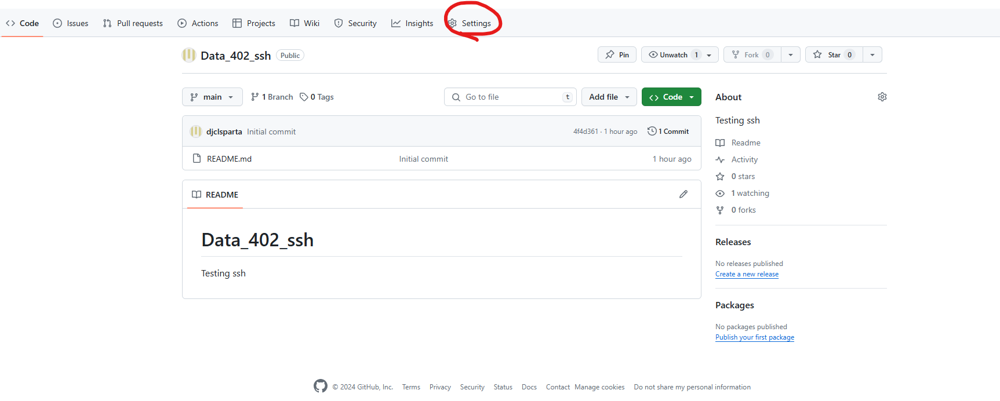
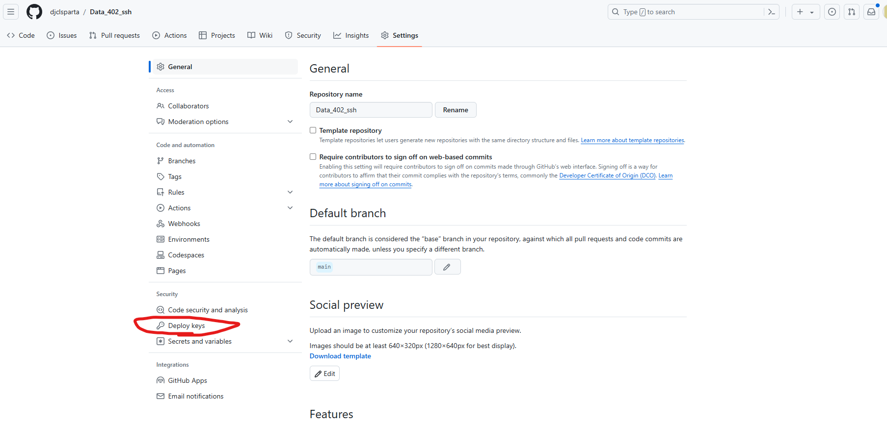
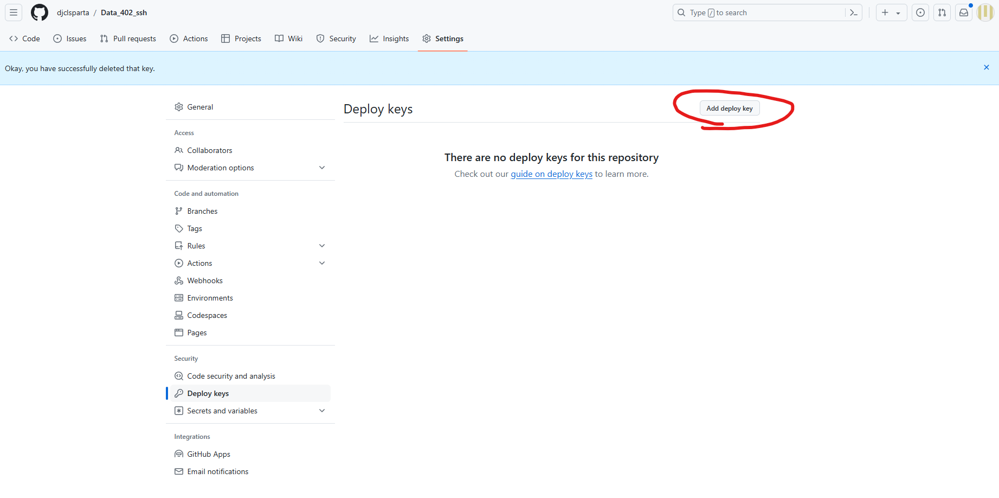
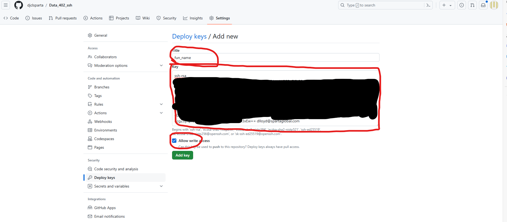

# Setting up ssh with github
We shall do all of this all in one git bash terminal.

## First make a new repository (if you need to)
Make a new github repository, we will use an example called Data_402_ssh

## Creating keys

Execute `cd ~/.ssh`

Execute `ssh-keygen -t rsa -b 4096 -C "<email>"`
where <email> is your email address.

choose a name, we use `git_test_key`

Now we need to coppy the public key

`cat git_test_key.pub`


You should get something like that.

Copy this and go to your github

## Adding public key to github
In your repo go to settings


Now to Deploy Keys


Add deploy key


Give it a name, paste what you copied into the Key box, and ensure you check Allow write access.


Press that big green "Add key" button.

## **Exit ouit of the ssh folder**

Now we exit out of the .ssh folder by simply executing `cd`

## Authenticating

Firstly, we start the ssh agent using
```
eval `ssh-agent`
```

It should return `Agent pid XXXX` where X are numbers

Then we add the key:
```
ssh-add ~/.ssh/git_test_key
```
We will then get confirmation that identity has been added.

Let's move to where we want to work with the git `cd ./my/folder`

Run `ssh -T git@github.com` and we should receive a lovely welcome message from github:
```
Hi djclsparta/Data_402_ssh! You've successfully authenticated, but GitHub does not provide shell access.
```

## Finished

Now we are finished, and can clone our repository using 
`git clone git@github.com:djclsparta/Data_402_ssh.git`