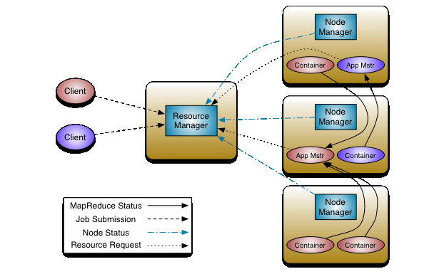

Big Data is a quantity of data that's so large that traditional approaches to data analysis are doomed to failure

## Vs of big data:
- Value
    - Viability
    - Variety
    - Velocity
    - Veracity
    - Volume

## Hadoop:
- Scalable 
  - Horizontal Scaling - add more machines in parallel
  - Vertical Scaling - Replacing machines with bigger/better machines
- Flexible
  - Easy to store huge datasets - decide how to use them later
- Economical
  - No licensing costs
  - Can use ordinary computers for data processing
- Reliable
  - Stores multiple copies of data on different machines 
  - Resistant to hardware failure

### Components
- Hadoop Distributed File System
  - HDFS
  - Provides high-throughput access to application data
- Yet Another Resource Negotiator
  - YARN
  - Framework for job scheduling and cluster management
- MapReduce
  - YARN-based system for parallel processing of data

### Ecosystem
The Apache Hadoop project develops open-source software for reliable, scalable, distributed computing.

The Apache Hadoop software library is a framework that allows for the distributed processing of large data sets across clusters of computers using simple programming models.
It is designed to scale up from single servers to thousands of machines, each offering local computation and storage.
Rather than rely on hardware to deliver high-availability, the library itself is designed to detect and handle failures at the application layer, so delivering a highly-available service on top of a cluster of computers, each of which may be prone to failures.

#### HDFS
Hadoop Distributed File System is the primary storage system used by Hadoop applications. 
This open source framework works by rapidly transferring data between nodes.

#### YARN
Yet Another Resource Negotiator splits up the resource management and job scheduling/monitoring into separate daemons.
The idea is to have a global ResourceManager( RM) and per-application ApplicationManager (AM).
An application is either a single ob or a DAG (Directed Acyclic Graph) of jobs

#### MapReduce
MapReduce is a processing technique and a program model for distributed computing based on java.
The MapReduce algorithm contains two important tasks, namely Map and Reduce. Map takes a set of data and converts it into another set of data, where individual elements are broken down into tuples (key/value pairs). 
Secondly, reduce task, which takes the output from a map as an input and combines those data tuples into a smaller set of tuples.
As the sequence of the name MapReduce implies, the reduce task is always performed after the map job.

- Generally MapReduce paradigm is based on sending the computer to where the data resides!
- MapReduce program executes in three stages, namely map stage, shuffle stage, and reduce stage.
  - Map stage − The map or mapper’s job is to process the input data. Generally the input data is in the form of file or directory and is stored in the Hadoop file system (HDFS). The input file is passed to the mapper function line by line. The mapper processes the data and creates several small chunks of data.
  - Reduce stage − This stage is the combination of the Shuffle stage and the Reduce stage. The Reducer’s job is to process the data that comes from the mapper. After processing, it produces a new set of output, which will be stored in the HDFS.
- During a MapReduce job, Hadoop sends the Map and Reduce tasks to the appropriate servers in the cluster.
- The framework manages all the details of data-passing such as issuing tasks, verifying task completion, and copying data around the cluster between the nodes.
- Most of the computing takes place on nodes with data on local disks that reduces the network traffic.
- After completion of the given tasks, the cluster collects and reduces the data to form an appropriate result, and sends it back to the Hadoop server.

